<!-- --
# TODO

- Condenser les premières slides pour aller vite, mais pas passer les slides vite
- Présenter initiative personelle : code
- Techniques plus poussées
- Architecture duplication et normalisation des données
- Architecture finale, intermédiaires ?
- Graphiques apprentissage
- Visualisation des layers du RNA

---
<!-- -->

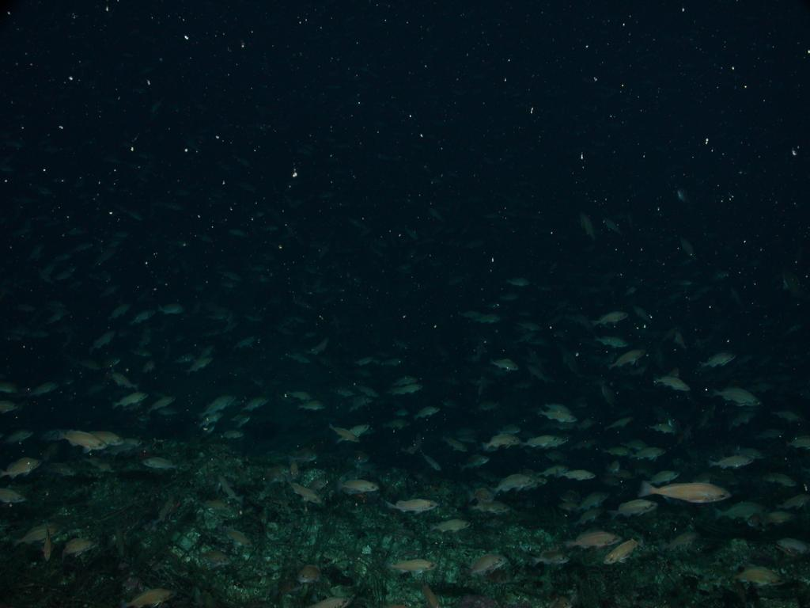

Deep learning appliqué à la reconaissance visuelle d'espèces marines
===
 
 

   
  <!--Ou comment ne pas confondre un poisson rouge avec ce magnifique Mola-mola-->

---

# Le problème

- Étudier la répartition des espèces vivant dans l'océan, de façon non-destructive et plus automatisée
- Équiper les sous-marins autonomes
- Réduire considérablement les coûts

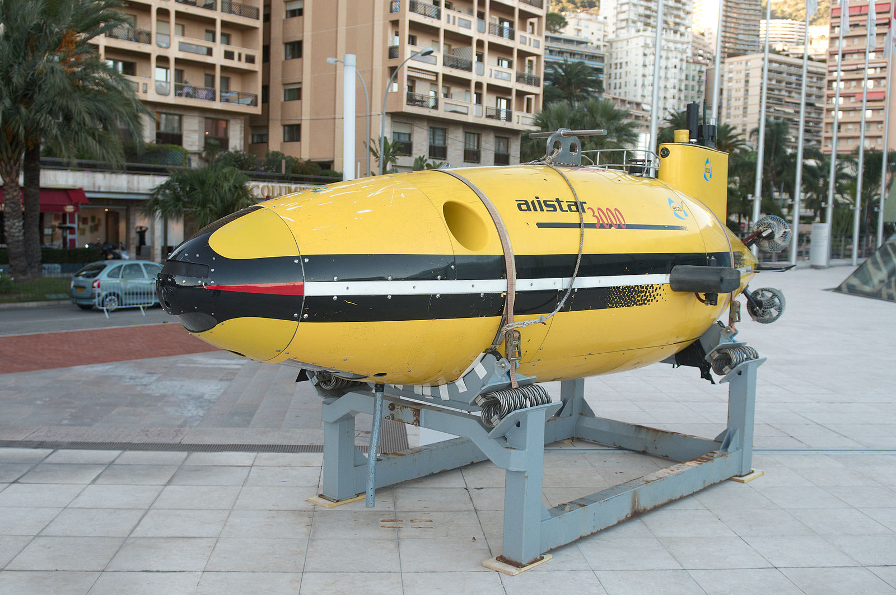 
  Alistar 3000

---

# Les aspects difficiles de ce problème

- Complexité des fonds sous-marins
- Diversité des espèces
- Espèces se ressemblant, d'autres très distinctes

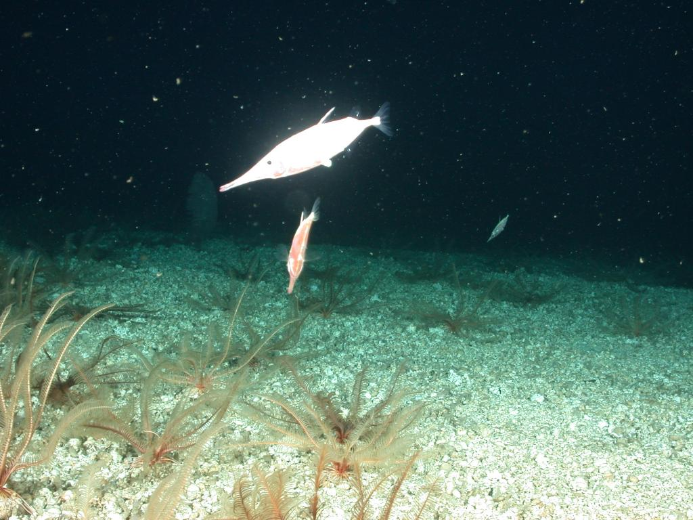 
  Image du dataset "Labeled Fishes in the Wild"

---

# Pourquoi le deep learning

- Difficulté des algorithmes conventionels
	- Se basent sur des régularités ici difficiles à trouver
- Besoin de recherche de caractéristiques complexes
	- Justifie le deep learning

---

# Problème traité

Données du data-set **"Fish Recognition Ground-Truth"**.

|Dascyllus reticulatus | Chromis chrysura | Amphiprion clarkii |
|-|-|-|
|Classe C1|Classe C2|Classe C3
| 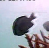 |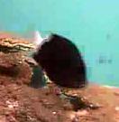|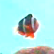|
| 12 111 exemples | 3 593 exemples |4 049 exemples |

- Trois classes
- Diverses tailles autour de $100\times 100$ pixels
- Aléatoire : succès d'environ $33\%$

---

# Séparation des données

| | Entraînement | Validation | Test |
|-|-|-|-|
|Dascyllus reticulatus| 4000 | 100 | 200
| *Chromis chrysura* | 3293 | 100 | 200 |
| *Amphiprion clarkii* | 3749 | 100 | 200 |
| **Total** | **11042** | **300** | **600** |

---

<!--# Analogie avec le problème du MNIST

Reconnaissance d'écriture manuscrite de chiffres du dataset MNIST.

 
  Donées du MNIST

- 10 classes
- 60 000 exemples d'entrainement
- Images normalisées et de taille fixe $20\times 20$ pixels
- Aléatoire : succès de 10%

--->

# Fonctionnement d'un réseau de neurones artificiel

> Un réseau de neurones est une manière de représenter un certain type de fonctions non-linéaires.

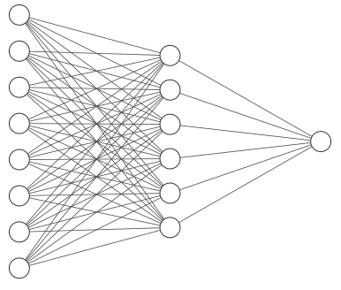

---

# Fonctionnement d'un neurone

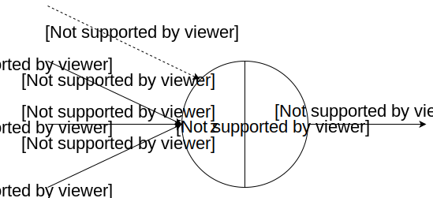

$$
z=b+\sum_{i=1}^n c_i
$$

$$
y=f(z)
$$

---

# Fonctions d'activation ($\sigma$)

|Fonction sigmoïde
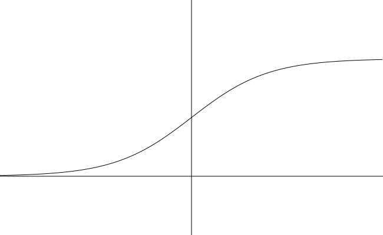
$y=\frac{1}{1+e^{-z}}$|Tangente hyperbolique

$y=tanh(z)$|
|------|---|
|**ReLU**
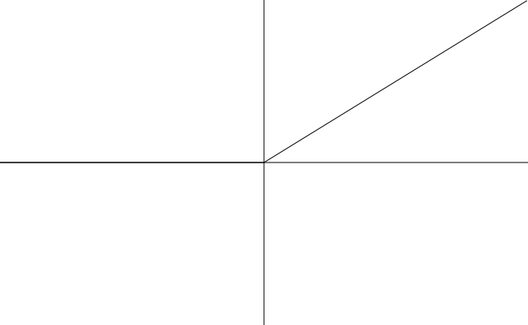
$y=\max(0,z)$|**Weak ReLU**
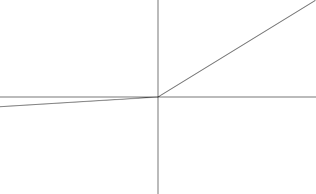
$y=\max(\epsilon z,z)$|

---

# Couche de neurones simple

Couche dense de neurones d'indice $l$

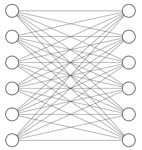

$$
A^l\ \ \ \ \ \ \ \ \ \ \ \ \ \ \ \ \ \ \ \ \ \ \ \ \ \ \ \ \  Y^l
$$

---

# Représentation matricielle d'une couche de neurones

Variables apprises : $W^l$ et $B^l$

$$
Z^l = W^l\times A^l + B^l
$$

$$

Z^l =
\begin{pmatrix} 
w_{1,1} & w_{1,2} & \cdots &w_{1,n} \\
w_{2,1} & w_{2,2} & \cdots &w_{2,n} \\
\vdots & \vdots & \ddots & \vdots \\
w_{p,1} & w_{p,2} & \cdots &w_{p,n}
\end{pmatrix}
\times
\begin{pmatrix}
a_1 \\
a_2 \\
\vdots \\
a_n
\end{pmatrix}
+
\begin{pmatrix}
b_1 \\
b_2 \\
\vdots \\
b_p
\end{pmatrix}
$$

$$
Y^l = \sigma(Z)
$$

---

# Réseau de neurones complet

$$
Y^0
$$

$$
	Y^1 = \sigma(W^1\times Y^0+B^1)
$$

$$
	\vdots
$$

$$
	Y^L = \sigma(W^L\times Y^{L-1}+B^L)
$$

---

# Apprentissage d'un réseau de neurones

- Processus itératif de minimisation d'une fonction de coût
- Données d'entraînement, validation et test
- Apprentissage sur un mini-batch

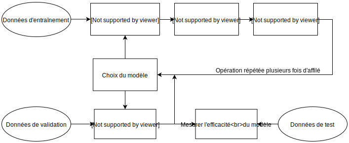

---

# Fonction de coût $L_2$

Sur un mini-batch de taille $m$, on note $y_i$ la sortie du réseau de neurones avec pour entrée $x_i$, et $\hat{y}_i$ la sortie attendue pour cette entrée.

$$
C=\frac{1}{m}\sum_{i=1}^m (\hat{y}_i-y_i)^2
$$

---

# Descente de gradient

$$
W = W - \lambda \frac{\partial C}{\partial W}
$$

$$
B = B - \lambda \frac{\partial C}{\partial B}
$$

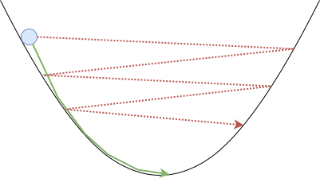

---

# Classification avec un réseau dense

<!---

MNIST: lambda = 0.3
D(300) -> tanh -> D(100) -> tanh -> D(10) -> tanh
=> 98.02

Fishes:

D(800) -> tanh -> D(300) -> tanh -> D(100) -> tanh -> D(3) -> tanh 

-->

| Succès | epochs | $\lambda$ | mini-batch |
|-|-|-|-|
|$96.83\%$| 60 | 0.02 | 40

| | C1 | C2 | C3 |
|-|-|-|-|
| Bien classés| 189/200 | 193/200 | 199/200 |
| Faux positifs | 8 | 8 | 3 |
| Faux C1 | - | 7 | 1 |
| Faux C2 | 8 | - | 0 |
| Faux C3 | 3 | 0 | - |

---

# Rendre le réseau plus efficace

Insuffisance des techniques initiales. On va utiliser :

- Momentum based gradient descent
- Couches "softmax" et fonction de coût "log-likelihood"
- Batch normalization
- Convolutions

---

# Momentum based gradient descent
Inspirée de la physique : balle dans un creux.

$$
M_W=M_W - \lambda \frac{\partial C}{\partial W}
$$
$$
W=W + M_W
$$

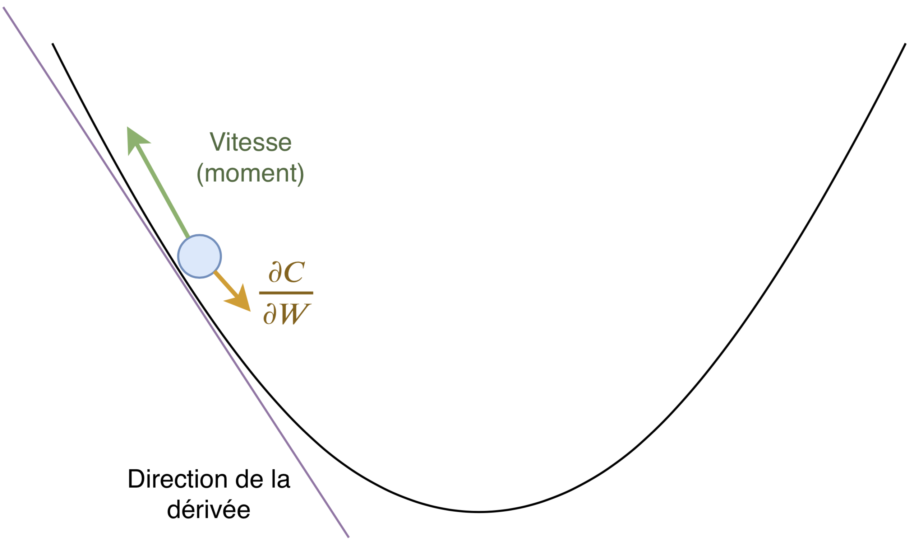

---

# Softmax

Représenter une distribution de probabilité pour un classifieur. Utile car on veut classifier les espèces.

$$
y^L_j=\frac{e^{z_j^L}}{\sum_i e^{z_i^L}}
$$

### Fonction de coût log-likelihood

$$
C=-\log(y^L_{i_0})
$$

Avec $i_0/\hat{y}_{i_0}=1$, et $\forall j\neq i_0,\ \hat{y}_j=0$.

---

# Résultats avec ces améliorations

<!---

MNIST: lambda = 0.3
D(1000) -> ReLU -> D(800) -> ReLU  -> D(300) -> ReLU -> D(10) -> softmax
=> 98.16%

Fishes:

D(800) -> tanh -> D(300) -> tanh -> D(100) -> tanh -> D(3) -> sigmoid 

-->

| Succès | epochs | $\lambda$ | mini-batch |
|-|-|-|-|
|$97.50\%$| 60 | 0.04 | 40

| | C1 | C2 | C3 |
|-|-|-|-|
| Bien classés| 199/200 | 191/200 | 195/200 |
| Faux positifs | 14 | 1 | 0 |
| Faux C1 | - | 9 | 5 |
| Faux C2 | 1 | - | 0 |
| Faux C3 | 0 | 0 | - |

---

# Normalisation des entrées

$$
\mu=\frac{1}{n}\sum_{i=1}^nX^{(i)}\ \ \ \ \ \text{et} \ \ \ \ \ \sigma=\sqrt{\frac{1}{n}\sum_{i=1}^n(X^{(i)}-\mu)^2}
$$

$$

$$

Avec le carré élément par élément (au sens du produit de Hadamard).

$$
X^\prime=\frac{X-\mu}{\sigma}
$$

---

# Normalisation des activations

- $\mu$ et $\sigma$ calculés sur un batch
- $\alpha$ et $\beta$ paramètres appris par le réseau, $\gamma\in]0;1[$ fixe

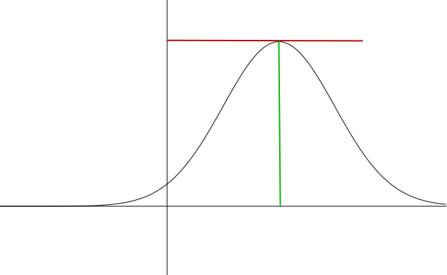

$$
\hat{\mu}=\gamma\hat{\mu}+(1-\gamma)\hat{\mu}
\ \ \ \ \ \ \text{et} \ \ \ \ \ \ \hat{\sigma}=\gamma\hat{\sigma}+(1-\gamma)\hat{\sigma}
$$

$$
a_{\text{norm}}=\alpha\frac{a-\hat{\mu}}{\hat{\sigma}}+\beta
$$

---

# Améliration en normalisant les activations

<!---

Fishes:

Norm -> D(800) -> tanh -> Norm -> D(300) -> tanh -> Norm -> D(100) -> tanh -> D(3) -> sigmoid 

-->

| Succès | epochs | $\lambda$ | mini-batch |
|-|-|-|-|
|$99.33\%$| 60 | 0.04 | 40

| | C1 | C2 | C3 |
|-|-|-|-|
| Bien classés| 198/200 | 198/200 | 200/200 |
| Faux positifs | 2 | 2 | 0 |
| Faux C1 | - | 2 | 0 |
| Faux C2 | 2 | - | 0 |
| Faux C3 | 0 | 0 | - |

---

# Convolution

Adapté au traitement d'une image :
- Traitement local
- Similaire sur toute l'image

---

# Filtre sur plusieurs channels

Les filtres de convolution 2D sont des matrices 3D.

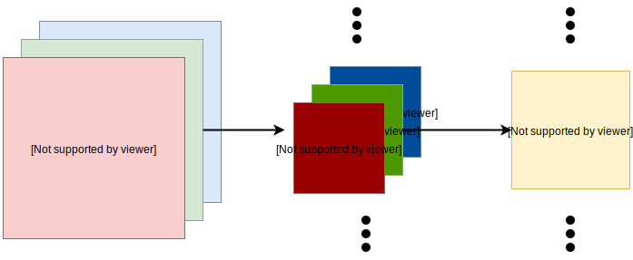

---

# Max-pool layer

Réduire le nombre d'informations en ne sélectionnant que les plus importantes.

---

# Convolutional network

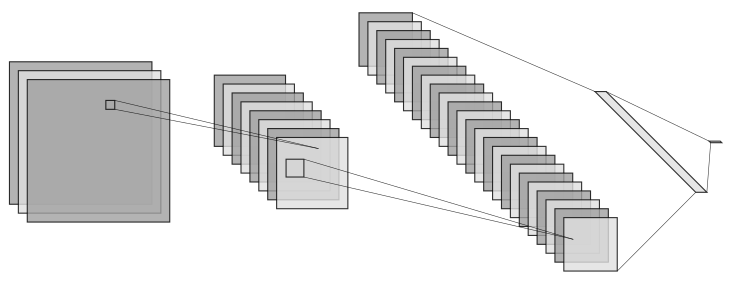

---

# Résultats avec un ConvNet

<!---

MNIST: lambda = 0.3
C((5, 5), 20) -> P(2,2) -> ReLU -> C((5, 5), 40) -> ReLU -> C((3, 3), 32) -> P(2,2) -> ReLU -> D(800) -> ReLU -> D(300) -> ReLU -> D(100) -> ReLU -> D(10) -> softmax
=> 99.05

Fishes:

Norm -> D(800) -> tanh -> Norm -> D(300) -> tanh -> Norm -> D(100) -> tanh -> D(3) -> sigmoid 

-->

| Succès | epochs | $\lambda$ | mini-batch |
|-|-|-|-|
|$99.50\%$| 60 | 0.06 | 40

| | C1 | C2 | C3 |
|-|-|-|-|
| Bien classés| 199/200 | 198/200 | 200/200 |
| Faux positifs | 2 | 0 | 1 |
| Faux C1 | - | 2 | 0 |
| Faux C2 | 0 | - | 0 |
| Faux C3 | 1 | 0 | - |

---

# Architecture finale

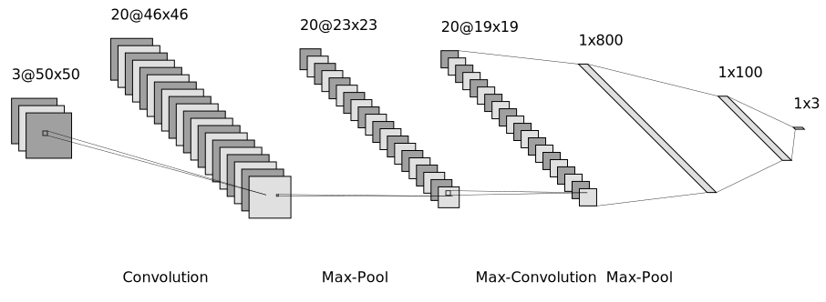

